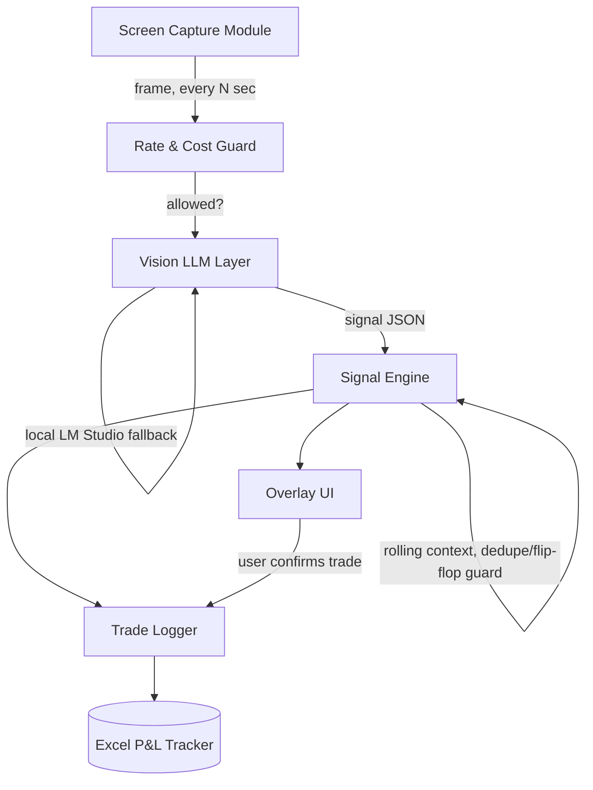

# AI Trader — Floating Real-Time Trading Copilot
### Project Plan

---

## 1. Overview & Goals

**What it is:** A lightweight, always-on-top desktop overlay that continuously watches
your screen while you trade — across NSE/BSE, US stocks, and crypto — sends what it sees
to free vision-capable LLMs (OpenRouter / NVIDIA NIM / opencode), and surfaces a live
trading call directly on screen: buy/sell/hold, position size, entry point, stop-loss /
target, and timing. Every signal you act on gets logged to an Excel P&L tracker, so the
tool's own track record becomes visible over time.

**What "done" (MVP) looks like:** an overlay app that (1) captures a chosen screen region
at a set interval, (2) sends it to a vision LLM with a structured trading-analysis prompt,
(3) renders the resulting signal — action, entry, stop, target, size, confidence — as a
small floating panel, and (4) lets you log the trade (and its outcome) to the Excel
tracker with one keystroke.

**Constraints & assumptions this plan is built around:**
- **Budget: $0.** Free-tier APIs only — OpenRouter free models, NVIDIA NIM free tier,
  opencode. No paid inference.
- **Solo build**, using the AI coding agents you already work with (Antigravity, Claude
  Code, Codex).
- **Windows-first**, matching your ASUS ROG Strix G16. An always-on-top overlay is
  simplest to build well on one OS first; cross-platform is a stretch goal, not MVP.
- **Advisory only.** The tool tells you what it thinks — it never places an order. No
  broker/exchange execution API in this plan. That's a deliberate scope line, not an
  oversight: it keeps a hallucinated signal from ever costing you money by itself.
- **"Real time" = near-real-time.** Free vision APIs have latency and rate limits, so
  polling every 5–30 seconds is the realistic target, not tick-by-tick. This suits
  swing/short-term setups better than scalping — worth knowing going in.
- **All markets, continuous polling**, per your answers — the architecture below is
  built for that from the start rather than bolted on later.

---

## 2. Architecture

Seven components, one data flow: capture → analyze → decide → show/log.

1. **Screen Capture Module** — periodic screenshot of a *user-selected region* (the
   trading platform window), not the full desktop. Region-limited on purpose: it's
   faster to encode, cheaper per API call, and doesn't leak whatever else is open.
   `mss` or `pyautogui`/`Pillow`.

2. **Rate & Cost Guard** — tracks calls-per-minute against each free tier's limits,
   throttles, and decides which provider gets the next call. This sits in front of the
   Vision LLM Layer, not inside it — it's the piece that makes "continuous polling on
   free tiers" survive a full trading session instead of dying at minute 20.

3. **Vision LLM Layer** — a provider-agnostic interface with a fallback chain:
   OpenRouter free vision models → NVIDIA NIM free endpoints → opencode → (Phase 6)
   local vision model via LM Studio on your RTX 5070 Ti, as a last resort when every
   free API is throttled. Same interface, swappable backend.

4. **Signal Engine** — the prompt layer. Sends the frame plus a structured instruction
   asking for strict JSON: `action, confidence, entry, stop_loss, target,
   position_size_pct, timeframe, reasoning`. Keeps a short rolling memory of the last
   few reads per symbol so it doesn't flip buy→sell→buy on ordinary chart noise.

5. **Overlay UI** — the always-on-top floating panel showing the current call, its age
   ("signal is 8s old"), and confidence. `PyQt6` is the default choice: lighter than
   Electron, native always-on-top support, and matches the Python stack the rest of
   this uses.

6. **Trade Logger** — on your confirmation keypress, appends a row to the Excel tracker
   (entry, stop, target, size); on close, fills in exit and lets the workbook's own
   formulas compute P&L. Uses `openpyxl`.

7. **Config** — screen region, polling interval, active markets, API keys, per-market
   prompt tweaks.

**Why screen-watching instead of API integration with each broker/exchange:** it's the
one approach that works identically whether you're looking at Kite, TradingView, or a
crypto exchange — no per-platform integration work, at the cost of needing a vision
model instead of structured price data.

---

## 3. Phase-by-Phase Roadmap

| Phase | Objective | Key deliverable | Exit criteria |
|---|---|---|---|
| **0 — Provider validation** (Done) | Confirm at least one free vision API is actually usable for chart reading | Script that screenshots a chart and prints raw model output from 2+ providers | One provider returns coherent, structured analysis from a real chart |
| **1 — MVP signal reader** (Done) | Prove the core loop works, no UI yet | CLI tool: hotkey → capture region → structured JSON signal in the console | Manually-triggered signal is usable on at least one asset class |
| **2 — Floating overlay** (Done) | Get the signal on screen | Always-on-top PyQt6 panel showing the latest call | Overlay updates correctly while the trading platform has focus |
| **3 — Continuous polling + fallback** (Done) | Make it actually "watch all the time" | Background polling loop, multi-provider rotation, frame-diffing to skip unchanged frames | Runs a full session without crashing or exhausting every provider's quota |
| **4 — Trade logging** (Done) | Close the loop from signal to P&L | Confirm/close hotkeys wired to the Excel tracker (shipped with this plan) | A full signal → confirm → close cycle logs an accurate row |
| **5 — Refinement** (Done) | Make signals trustworthy day to day | Per-market prompt tuning, risk-% based position sizing, high-confidence alerts | Signals feel consistent enough for daily real use |
| **6 — Local fallback** (Done) | Reliability when free APIs are down/throttled | Multi-provider fallback chain guarantees a last-resort backend; a local ollama provider is already in the chain | Overlay keeps producing signals through a provider outage |

> **Phase 6 acceptance (2026-08-19):** the provider fallback chain was already
> guaranteed-endpointed by `noop` (test: `test_provider_chain_falls_through_when_all_cloud_providers_out`
> drives openrouter + anthropic + ollama into failures and asserts the chain
> still lands on `noop` without crashing). The stretch goal of a dedicated
> LM Studio backend remains open as future work — the real fix for "local
> model with actual inference", while the chain guarantee covers the outage
> reliability win that Phase 6 was defined for.

---

## 4. Timeline & Milestones

No hard deadline was given, so this is a pacing suggestion for evenings/weekends
around coursework — treat every date as flexible, not fixed.

| Week | Phases | Milestone |
|---|---|---|
| 1 | 0 → 1 | ✔ First real signal printed to console from a live chart |
| 2 | 2 | ✔ Overlay visibly floating over your trading platform |
| 3 | 3 | ✔ First full session run without the tool falling over |
| 4 | 4 | ✔ **First fully usable version** — signal → trade → logged P&L |
| 5–6 | 5 | Signals feel good enough to actually rely on |
| Ongoing | 6 | Local fallback added when free-tier limits start to bite |

Week 4 is the meaningful milestone — that's when the tool is a complete, if rough,
loop rather than a collection of parts.

---

## 5. Resources & Team Needs

- **Team:** you, solo — using Antigravity / Claude Code / Codex as build partners.
- **Hardware:** ASUS ROG Strix G16 (RTX 5070 Ti, 12GB VRAM) — already sufficient for
  the Phase 6 local vision-model fallback via LM Studio.
- **Accounts needed (all free tier):** OpenRouter, NVIDIA NIM, opencode.
- **Libraries:** `mss`/`pyautogui` (capture), `PyQt6` (overlay), `openpyxl` (Excel),
  `requests` or provider SDKs (API calls), `keyboard`/`pynput` (hotkeys).
- **Reuse opportunity:** ARES AI already has a working OpenRouter/Gemini inference
  pattern — the provider-abstraction logic there is a reasonable starting point for
  this project's Vision LLM Layer rather than building that from zero.
- **Budget:** $0 beyond time, by design.

---

## 6. Risks & Mitigations

| Risk | Mitigation |
|---|---|
| Free-tier vision APIs get rate-limited mid-session | Multi-provider rotation (Phase 3) + frame-diffing to cut call volume + local fallback (Phase 6) |
| Vision model misreads a chart and gives a confidently wrong signal | Advisory-only by design; show confidence; require explicit confirmation before it's logged as a real trade; never auto-execute |
| Full-screen capture exposes other open windows/personal info | Capture is region-limited to the trading platform window only, never the full desktop |
| Signal flip-flops between reads on ordinary noise | Rolling short-term memory per symbol + a minimum hold time before a call is allowed to flip |
| Polling latency makes "timing" stale in fast markets (esp. crypto) | Display signal age on the overlay; treat this as a swing/short-term tool, not a scalping one, in v1 |
| Free-tier quality silently degrades to a weaker model on a given provider | Log which provider/model served each signal, so a quality drop is traceable, not mysterious |

---

## 7. Success Metrics

- **Functional MVP:** overlay produces a full signal (action/entry/stop/target/size)
  in under ~10s during continuous polling, for at least one asset class.
- **Reliability:** survives a full trading session (4+ hrs) without crashing or fully
  exhausting free-tier quota across all providers.
- **Logging accuracy:** every confirmed trade lands in the Excel tracker with correct
  auto-computed P&L.
- **The real metric:** after 2–4 weeks of use, the Dashboard tab in the tracker (which
  splits win rate by *AI-sourced vs. manual* signals) shows whether following the
  tool's calls is actually net-additive over your own reads. That comparison is the
  whole point of logging Signal Source — the tracker doubles as the evaluation
  harness for the tool itself.

---

*Companion file: `Trade_Log_Tracker.xlsx` — the Phase 4 Excel tracker, built and
ready to use standalone from day one (you don't need the overlay built to start
logging trades manually).*
